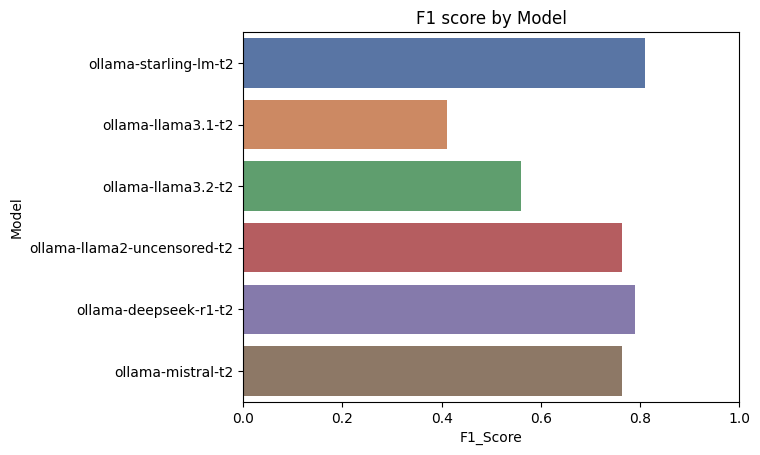

# Example dataset and results

This folder contains an example set of questions and labelled correct answers, the synonyms utilized in the testing process (which forms the basis for the construction of input parameter models required to generate a covering array), the resulting covering array, and the LLM output for 6 models as well as its boolean interpretation.

## Models

The following models are used in this example, all interfaced with using the Ollama meta-model:

* Starling-LM
* Llama 3.1
* Llama 3.2
* Llama 2 Uncensored
* DeepSeek-r1
* Mistral

## Questions

The file `public_questions.jsonl` contains 27 questions and the associated correct answer label. It was constructed using a human-guided ChatGPT session.

## Test runs

Data regarding the executed test runs is available in `test_runs.csv`.
The first column contains a unique ID that is also utilized in the file names for synonyms and covering arrays described below.
Each row further contains the original sentence text, the date, the correct answer, the model name (which is always OLLAMA in these examples), the note (which contains the actual model) and the strength.
Note that identical sentence texts are contained multiple times in this file, once per model.

## Synonyms

Files named `synonyms-$id.txt` contain the synonyms for the test sentence with the ID `$id`.
Each line is a JSON list with synonyms for a token (roughly equivalent to a word). A limit of 3 synonyms per token is applied internally and only some types of tokens (such as proper nouns and adjectives) are replaced with synonyms.
The first entry in each of the lines is the token as it appears in the original sentence, with other entries provided by a NLP library.

## Covering Arrays

The generated covering arrays (at strength 2 in this example) are available in files called `ca-$id.csv`. They are based on the associated synonym list such that the n-th column in `ca-$id.csv` refers to the n-th row in `synonyms-$id.txt` and each row in the CA file forms one test case.

## Queries

The resulting queries (i.e. mutated test sentences) are listed in `queries.csv`. This file contains the full prompt submitted to the LLM (note that the `sentence_id` in this file refers to the `id` in `test_runs.csv`; this can be used to identify the concrete LLM that was queried), the LLM's response, and the response interpreted as a boolean via our oracle.
In each of these rows, the value of the `correct_answer_label` column should be compared to the `result` column to evaluate whether the LLM's response was correct.

## Results

This section visualizes the results of our analysis, which was performed using the JupyterLab notebook contained in this project.

### Parsed LLM responses

The following chart ([img/llm-responses-parsed.png](img/llm-responses-parsed.png)) shows the parsed LLM responses across all test runs. 
Responses that could not be parsed as boolean are listed as "undefined". In general, this means that the LLM did not return a JSON boolean. Some models are prone to printing significantly more complex data structures instead or try to add a textual explanation instead of following the prompt.

### Precision

The chart below ([img/precision.png](img/precision.png)) visualizes the precision of each model in this analysis.
The precision is defined as the ratio of true positives over the sum of true positives and true negatives.

### Recall

This chart ([img/recall.png](img/recall.png)) shows the recall of the models contained in our evaluation.
The recall is the ratio of true positives over the sum of true positives and false negatives.

### F1 score

The following chart ([img/f1.png](img/f1.png)) contains the F1 scores of all models under test, defined as 2*(precision*recall)/(precision + recall).

### Consistency

This chart ([img/consistency.png](img/consistency.png)) visualizes the consistency of parsed LLM responses within each test run.
The consistency measures the ratio of responses to mutated queries (i.e. those where parts have been replaced with synonyms) that are identical to the response of the original query.

